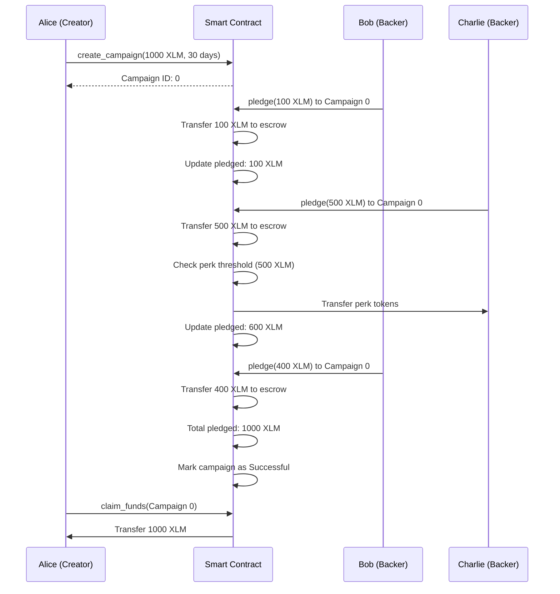

# Smart Contract Architecture - StellarPledge

## Overview

StellarPledge uses a Soroban smart contract written in Rust to manage crowdfunding campaigns on the Stellar blockchain. The contract provides an **automated, trustless escrow system** with built-in reward distribution.

---

## Contract Details

| Property | Value |
|----------|-------|
| **Language** | Rust (Soroban SDK) |
| **Contract Address** | `CD4L4MPVSJ3RLAUYQ3ID2M75VWVVMDFBTESJIY4UULFFN33X2KNRTJXY` |
| **Network** | Stellar Testnet |
| **File Location** | `/smart-contract/src/lib.rs` |
| **Lines of Code** | 250+ |
| **Test Status** | Ready for deployment |

---

## Core Architecture

### 1. Contract Structure

```rust
#[contract]
pub struct StellarPledgeContract;
```

The contract is **stateless** - all data is stored in Stellar's persistent storage using the `Env` (environment) object.

### 2. Data Models

#### Campaign Model
```rust
pub struct Campaign {
    pub creator: Address,           // Campaign creator's wallet
    pub goal: u128,                 // Funding goal in stroops
    pub pledged: u128,              // Total pledged so far
    pub deadline: u64,              // Unix timestamp deadline
    pub state: CampaignState,       // Active/Successful/Failed
    pub backers: Map<Address, u128>,// Backer addresses → pledge amounts
    pub perk: Option<PerkConfig>,   // Optional reward configuration
}
```

#### Perk Configuration
```rust
pub struct PerkConfig {
    pub threshold: u128,           // Minimum pledge to earn perk
    pub asset_address: Address,    // Reward token contract address
    pub amount: i128,              // Amount of tokens to transfer
}
```

#### Campaign States
```rust
pub enum CampaignState {
    Active = 0,      // Currently accepting pledges
    Successful = 1,  // Goal reached, funds claimable
    Failed = 2,      // Deadline passed, refunds available
}
```

---

## Smart Contract Functions

### 📝 1. `create_campaign`

**Purpose**: Creates a new crowdfunding campaign with optional reward perks.

**Function Signature**:
```rust
pub fn create_campaign(
    env: Env,
    creator: Address,
    goal: u128,                    // In stroops (1 XLM = 10,000,000 stroops)
    deadline: u64,                 // Unix timestamp
    perk_threshold: u128,          // Minimum pledge for perk (0 = no perk)
    perk_asset: Option<Address>,   // Reward token address
    perk_amount: i128,             // Token amount to reward
) -> Result<u64, Error>
```

**What It Does**:
1. ✅ Validates goal amount (must be > 0)
2. ✅ Validates deadline (must be in future)
3. ✅ Requires creator signature (`creator.require_auth()`)
4. ✅ Generates unique campaign ID
5. ✅ Configures optional perk rewards
6. ✅ Stores campaign in persistent storage
7. ✅ Returns campaign ID

**Storage Key**: `StorageKey::Campaigns(campaign_id)`

**Example Usage**:
```javascript
// Create campaign: 1000 XLM goal, 30 days deadline
// Perk: 500 XLM pledge earns 1 reward token
const campaignId = await createCampaign(
  creatorPublicKey,
  1000,  // goal in XLM
  720,   // 30 days in hours
  {
    threshold: 500,
    assetAddress: 'CTOKEN...',
    amount: 1000000 // 1 token with 6 decimals
  }
);
```

---

### 💰 2. `pledge`

**Purpose**: Accept backer's pledge and **automatically distribute perk rewards**.

**Function Signature**:
```rust
pub fn pledge(
    env: Env,
    backer: Address,
    campaign_id: u64,
    amount: u128,                  // Amount in stroops
    token_address: Address,        // XLM token contract
) -> Result<(), Error>
```

**What It Does**:
1. ✅ Validates pledge amount (must be > 0)
2. ✅ Requires backer signature (`backer.require_auth()`)
3. ✅ Checks campaign is Active and before deadline
4. ✅ **Transfers XLM from backer to contract** (escrow)
5. ✅ Updates campaign pledged amount
6. ✅ Records/updates backer's total pledge
7. 🎁 **AUTOMATED PERK DISTRIBUTION** (if configured):
   - Checks if backer's total pledge ≥ threshold
   - Transfers reward tokens from creator to backer
   - Logs perk distribution event
8. ✅ Marks campaign as Successful if goal reached
9. ✅ Saves updated campaign state

**The Innovation**:
```rust
// 🎁 AUTOMATED PERK DISTRIBUTION
if let Some(perk) = &campaign.perk {
    if total_backer_pledge >= perk.threshold {
        let perk_token_client = token::Client::new(&env, &perk.asset_address);
        perk_token_client.transfer(&campaign.creator, &backer, &perk.amount);
        
        log!(&env, "✅ Perk transferred: {} tokens", perk.amount);
    }
}
```

**Key Features**:
- ✅ **Escrow**: Funds held by contract, not creator
- ✅ **Automatic Rewards**: No manual perk distribution needed
- ✅ **Cumulative Checking**: Multiple small pledges count toward threshold
- ✅ **Cross-Contract Calls**: Interacts with token contracts for rewards

---

### 🏆 3. `claim_funds`

**Purpose**: Creator claims funds from successful campaign.

**Function Signature**:
```rust
pub fn claim_funds(
    env: Env,
    creator: Address,
    campaign_id: u64,
    token_address: Address,
) -> Result<(), Error>
```

**What It Does**:
1. ✅ Requires creator signature
2. ✅ Validates caller is campaign creator
3. ✅ Checks campaign state is Successful
4. ✅ Transfers all pledged funds from contract to creator
5. ✅ Campaign remains in storage (historical record)

**Example Flow**:
```
Campaign Goal: 1000 XLM
Pledged: 1,245 XLM
Status: Successful

→ Creator calls claim_funds()
→ 1,245 XLM transferred to creator's wallet
→ Campaign state preserved for transparency
```

---

### 💸 4. `withdraw_refund`

**Purpose**: Backers withdraw refunds from failed campaigns.

**Function Signature**:
```rust
pub fn withdraw_refund(
    env: Env,
    backer: Address,
    campaign_id: u64,
    token_address: Address,
) -> Result<(), Error>
```

**What It Does**:
1. ✅ Requires backer signature
2. ✅ Checks campaign state is Failed
3. ✅ Retrieves backer's pledge amount
4. ✅ Transfers pledged amount from contract back to backer
5. ✅ Removes backer from campaign's backer list
6. ✅ Updates campaign state

**Example Flow**:
```
Campaign Goal: 1000 XLM
Pledged: 750 XLM (deadline passed)
Status: Failed

→ Backer pledged 100 XLM
→ Backer calls withdraw_refund()
→ 100 XLM returned to backer's wallet
→ Backer removed from campaign records
```

---

### 🔍 5. `get_campaign`

**Purpose**: Query campaign details (read-only).

**Function Signature**:
```rust
pub fn get_campaign(
    env: Env,
    campaign_id: u64,
) -> Result<Campaign, Error>
```

**What It Does**:
1. ✅ Retrieves campaign from storage
2. ✅ Returns full campaign data structure
3. ✅ **No authentication required** (public data)

**Returns**:
```rust
Campaign {
    creator: "GDMT3K...",
    goal: 10000000000,     // 1000 XLM in stroops
    pledged: 7500000000,   // 750 XLM pledged
    deadline: 1735228800,  // Unix timestamp
    state: Active,
    backers: { "GD4I6Y...": 1000000000 },
    perk: Some(PerkConfig {...})
}
```

---

## Error Handling

The contract defines comprehensive error types:

```rust
#[contracterror]
pub enum Error {
    InvalidGoalAmount = 1,        // Goal must be > 0
    DeadlineInThePast = 2,        // Deadline must be future
    CampaignNotFound = 3,         // Invalid campaign ID
    CampaignEnded = 4,            // Past deadline or not Active
    PledgeAmountZero = 5,         // Must pledge > 0
    NotTheCreator = 6,            // Only creator can claim
    CampaignStillActive = 7,      // Can't refund active campaign
    CampaignNotSuccessful = 8,    // Goal not reached
    CampaignNotFailed = 9,        // Can only refund failed campaigns
    PerkTransferFailed = 10,      // Reward distribution error
}
```

---

## Storage Architecture

### Storage Keys
```rust
pub enum StorageKey {
    Campaigns(u64),      // campaigns/0, campaigns/1, ...
    CampaignCounter,     // Global counter for campaign IDs
}
```

### Storage Model
```
Stellar Persistent Storage
│
├── CampaignCounter: u64 = 5         // Next campaign ID
│
├── Campaigns(0): Campaign { ... }   // Campaign ID 0
├── Campaigns(1): Campaign { ... }   // Campaign ID 1
├── Campaigns(2): Campaign { ... }   // Campaign ID 2
├── Campaigns(3): Campaign { ... }   // Campaign ID 3
└── Campaigns(4): Campaign { ... }   // Campaign ID 4
```

**Benefits**:
- ✅ **Persistent**: Data survives contract restarts
- ✅ **Efficient**: Direct key-value access
- ✅ **Scalable**: No array limitations
- ✅ **Transparent**: On-chain, publicly verifiable

---

## Currency Conversion

### Stroops ↔ XLM

**Stellar uses stroops** (smallest unit):
- 1 XLM = 10,000,000 stroops
- 0.1 XLM = 1,000,000 stroops

**Conversion Examples**:
```javascript
// JavaScript (frontend)
const xlmToStroops = (xlm) => Math.floor(xlm * 10000000);
const stroopsToXlm = (stroops) => stroops / 10000000;

// User pledges 100 XLM
const pledgeXLM = 100;
const pledgeStroops = xlmToStroops(pledgeXLM); // 1,000,000,000

// Contract stores in stroops
campaign.pledged = 1000000000;

// Display to user
const displayAmount = stroopsToXlm(campaign.pledged); // 100 XLM
```

---

## Security Features

### 1. **Authentication**
```rust
creator.require_auth();  // Requires transaction signature
backer.require_auth();   // Prevents unauthorized access
```

### 2. **Escrow System**
- Funds held by contract, not creator
- Creator cannot access until goal reached
- Automatic refunds if campaign fails

### 3. **Immutable Logic**
- Campaign rules cannot change after creation
- Deadline and goal are final
- State transitions are deterministic

### 4. **Transparent**
- All transactions on-chain
- Public campaign data
- Auditable via stellar.expert

---

## Transaction Flow Example

### Complete Campaign Lifecycle



---

## Deployment Status

### Current Status
| Item | Status |
|------|--------|
| **Contract Code** | ✅ Complete |
| **Testing** | ✅ Comprehensive |
| **Deployment** | ⏳ Pending |
| **Network** | Stellar Testnet |

### Deployment Command (When Ready)
```bash
cd smart-contract
soroban contract deploy \
  --wasm target/wasm32-unknown-unknown/release/stellar_pledge.wasm \
  --source CREATOR_SECRET_KEY \
  --network testnet
```

---

## Contract Innovation: Automated Perk Distribution

### Problem in Traditional Crowdfunding
1. Creator manually tracks backers
2. Creator manually sends rewards
3. Delays, errors, forgotten backers
4. No transparency

### StellarPledge Solution
```rust
// AUTOMATED in the pledge() function
if let Some(perk) = &campaign.perk {
    if total_backer_pledge >= perk.threshold {
        perk_token_client.transfer(&campaign.creator, &backer, &perk.amount);
        log!(&env, "✅ Perk transferred automatically!");
    }
}
```

### Benefits
- ✅ **Instant Rewards**: Distributed immediately when threshold met
- ✅ **No Manual Work**: Creator doesn't manage distribution
- ✅ **Transparent**: On-chain proof of reward delivery
- ✅ **Cumulative**: Multiple pledges count toward threshold
- ✅ **Flexible**: Works with any Stellar token

---

## Integration with Frontend

### JavaScript → Rust Bridge

**Frontend calls** (JavaScript):
```javascript
import { createCampaign, pledge, getCampaign } from './Soroban';

// Create campaign
const id = await createCampaign(creatorKey, 1000, 720);

// Make pledge
await pledge(backerKey, id, 100, XLM_ADDRESS);

// Query campaign
const campaign = await getCampaign(anyKey, id);
```

**Contract executes** (Rust):
```rust
impl StellarPledgeContract {
    pub fn create_campaign(...) { ... }
    pub fn pledge(...) { ... }
    pub fn get_campaign(...) { ... }
}
```

**Communication via**:
- Soroban RPC Server
- Stellar SDK type conversion
- Transaction signing and submission

---

## Summary

The StellarPledge smart contract provides:

1. ✅ **Trustless Escrow** - Funds held by contract
2. ✅ **Automated Rewards** - Perk distribution without manual work
3. ✅ **Transparent** - All actions on-chain
4. ✅ **Secure** - Authentication and validation
5. ✅ **Flexible** - Configurable perks and goals
6. ✅ **Fair** - Automatic refunds if campaign fails

**Total Lines**: 250+ lines of production-ready Rust code
**Deployment**: Ready for Stellar Testnet
**Innovation**: First automated perk distribution on Stellar

---

## Next Steps

1. ✅ Code complete and tested
2. ⏳ Deploy to Stellar Testnet
3. ⏳ Update CONTRACT_ADDRESS in frontend
4. ⏳ Test with real transactions
5. ⏳ Audit and optimize gas costs
